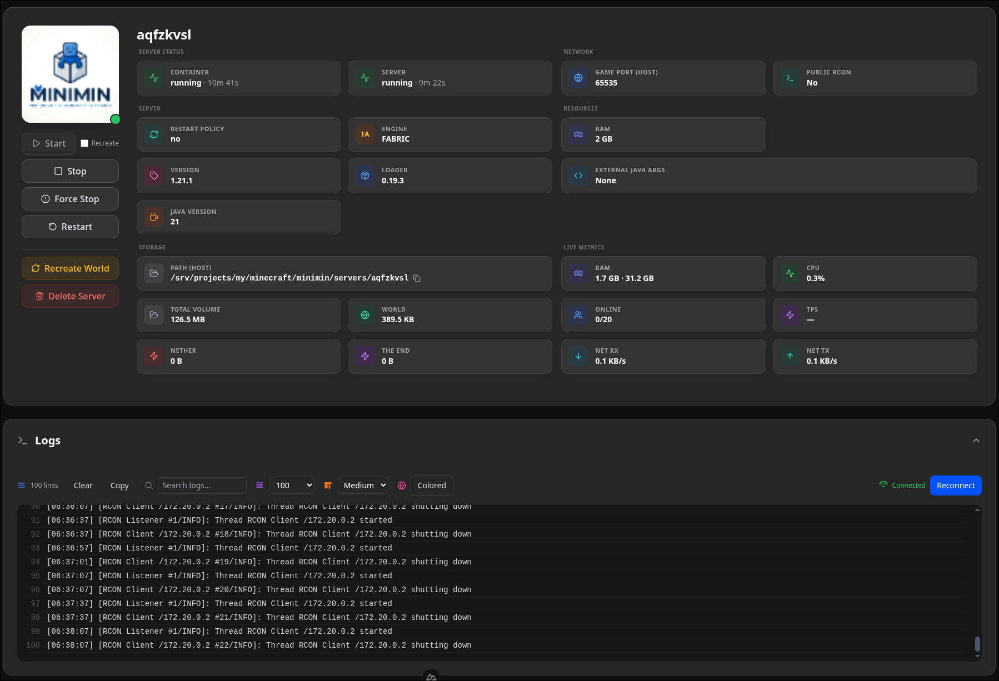
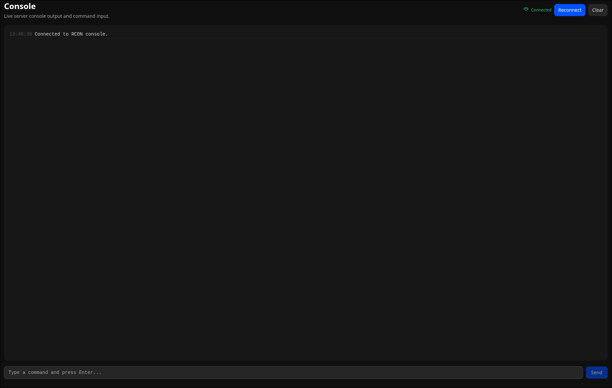
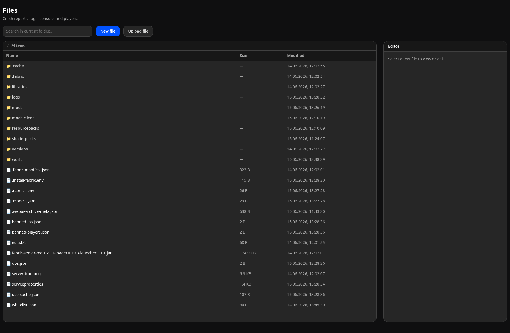
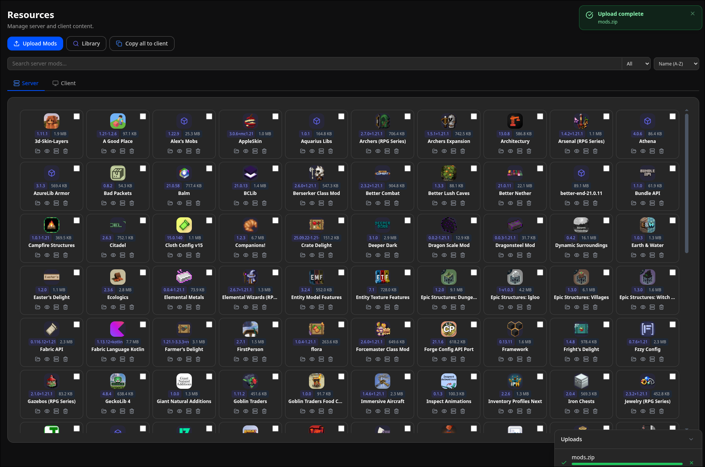
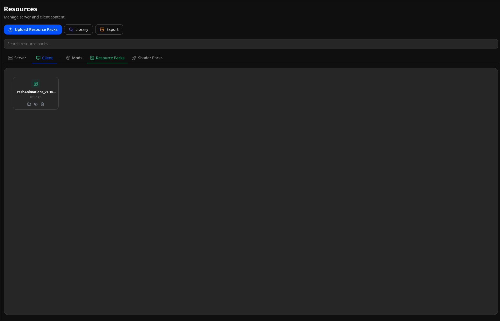
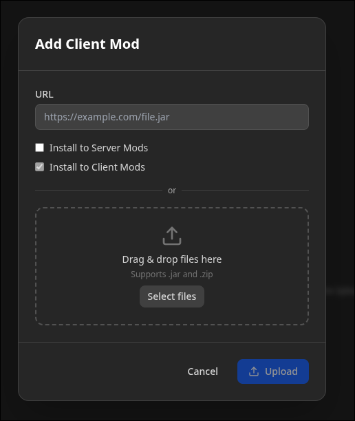
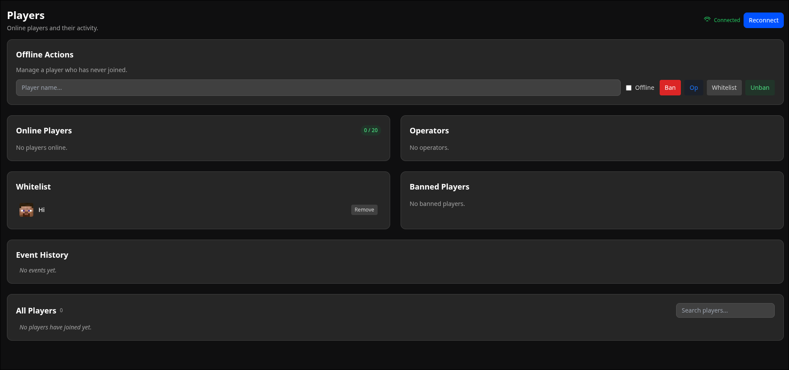

<p align="center">
  
</p>

<p align="center">
  <a href="https://github.com/quonaro/minimin/actions/workflows/docker-build.yml">
    
  </a>
  
  
</p>

# MiniMin

A lightweight, web-based control panel for managing multiple Minecraft servers via Docker.

## Features

- **Multi-Server Management** — Deploy, start, stop, and monitor multiple Minecraft servers from a single dashboard
- **Docker Orchestration** — Each server runs in its own isolated Docker container
- **File Management** — Browse, upload, download, and edit server files directly in the browser
- **Mod Management** — Install, remove, and toggle server-side and client-side mods
- **RCON Console** — Send commands to running servers via WebSocket
- **Real-Time Logs** — Stream server logs in real-time through WebSocket
- **Player Management** — View online players, bans, ops, and whitelist
- **Client Mod Archive** — Generate and share client mod packages with public download links
- **Minimin Sync** — Pair with the [desktop client](https://github.com/quonaro/minimin-sync) so players can auto-sync modpacks
- **Modrinth Integration** — Search and download mods directly from Modrinth

## Architecture

- **Backend**: Go + Docker SDK — orchestrates containers, exposes REST API and WebSocket endpoints
- **Frontend**: Nuxt 4 + Vue 3 + TailwindCSS — SPA dashboard served by Caddy
- **Reverse Proxy**: Caddy — serves static frontend and proxies `/api/*` and `/ws/*` to the backend
- **Process Manager**: supervisord — runs backend and Caddy in a single container

## Quick Start

### Requirements

- Docker & Docker Compose
- Docker socket access (for orchestrating Minecraft containers)

### Run

```bash
# 1. Clone the repository
git clone https://github.com/quonaro/minimin.git
cd minimin

# 2. Set a strong API key and host server directory
cp backend/.env.example backend/.env
# Edit backend/.env and set ORCHESTRATOR_API_KEY and MC_SERVERS_HOST_DIR

# 3. Start the stack
docker compose up -d

# 4. Open http://localhost:8080
```

### Web UI Access

The web UI requires a password to sign in. The password is the value of the `ORCHESTRATOR_API_KEY` environment variable that you set in `backend/.env`.

- **Production** (`docker compose up`): Use the key you configured in `backend/.env`. The web UI is served by Caddy at **http://localhost:8080**.
- **Development** (`docker compose -f docker-compose.yml up`): The default API key is **`test`** (set in `docker-compose.yml`). The frontend runs at **http://localhost:3000** and the backend API at **http://localhost:8081**.

> **Note:** There is no separate login — just enter your `ORCHESTRATOR_API_KEY` in the password field on the sign-in page.

### Docker Compose

| Service   | Description                                                         |
| --------- | ------------------------------------------------------------------- |
| `minimin` | Main container with Caddy (port 80) + Go backend (port 8081)        |
| `volumes` | `instance` — state file (`instance.yml`), `./servers` — server data |
| `ports`   | `8080:80` — web UI and API                                          |

### Environment Variables

| Variable                 | Default             | Description                                         |
| ------------------------ | ------------------- | --------------------------------------------------- |
| `ORCHESTRATOR_API_KEY`   | _(required)_        | Secret key for authentication (used as web UI password) |
| `ORCHESTRATOR_LOG_LEVEL` | `info`              | Backend log level: `debug`, `info`, `warn`, `error` |
| `MC_SERVERS_DIR`         | `/app/servers`      | Directory for server data inside the container      |
| `MC_SERVERS_HOST_DIR`    | _(required)_        | Absolute host path that maps to `MC_SERVERS_DIR`    |
| `MC_INSTANCE_FILE`       | `/app/instance.yml` | Path to state file                                  |

## Development

The project runs exclusively inside Docker. Use `dev.yml` for hot-reload development.

```bash
# 1. Ensure backend/.env exists with ORCHESTRATOR_API_KEY and MC_SERVERS_HOST_DIR
# 2. Export the same host directory for the compose file
export MC_SERVERS_HOST_DIR=/absolute/path/to/servers

# 3. Start dev stack
docker compose -f dev.yml up

# 4. Open frontend at http://localhost:3000
#    Backend API is available at http://localhost:8081
#    Default dev password: test (set in docker-compose.yml)
```

## Building

```bash
docker build -t minimin .
```

Multi-stage build:

1. `frontend-builder` — installs npm deps and generates static SPA
2. `backend-builder` — compiles Go binary
3. `runtime` — Alpine Linux with Caddy + supervisor

## Screenshots

> Commit screenshots to `docs/screenshots/` (or use GitHub drag-n-drop upload) and replace the paths below.

### Dashboard


Main dashboard — server cards with status, online players, quick actions.

### Server Console


Server console tab — real-time logs + RCON command input.

### File Manager


File manager — browsing server directories, editing config files.

### Mod Management


Mod management — installed mods list, toggle / remove / add from Modrinth.

### Resources


Resource packs & shaders management.

### Client Archive


Client mod archive — generating a public download link for players.

### Players


Online players, bans, ops, and whitelist view.

## License

Open source. See repository for details.
